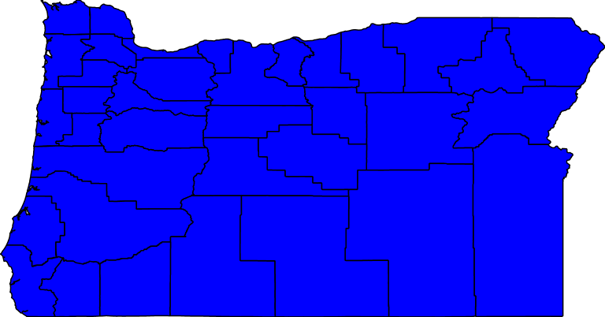

# transpobasemap

This repository contains the base map created for the final project. 

## GeoServer

[wms url](http://localhost:8080/geoserver/ceoas/wms?service=WMS&version=1.1.0&request=GetMap&layers=ceoas:ore_counties&styles=&bbox=-124.56670504390223,41.991794810535794,-116.46326242572455,46.23731681568611&width=768&height=402&srs=EPSG:4326&format=application/openlayers)

[wfs url](http://localhost:8080/geoserver/ceoas/ows?service=WFS&version=1.0.0&request=GetFeature&typeName=ceoas:ore_counties&maxFeatures=50&outputFormat=application%2Fjson)
[geojson data](asset/ore_counties.geojson)

## Base Map

The interactive base map page is hosted in [https://shangjiadong.github.io/netaccess/index.html](https://shangjiadong.github.io/netaccess/index.html)

## Design Process

This map is the first step for the final project. My goal of the project is to display the network accessibility, and I will 
be using travel time to represent the accessibility from a point to different regions of the network. The travel time will be 
a color platte with very bright color, e.g. with red representing the region that is hard to access and green denotes the region that 
can be easily accessed, and also there will be other colors such as yellow as a transition. Therefore, I cannot use very bridge color 
on the base map, which otherwise will make the map too complicated. 

The color I used on the map is from [https://coolors.co/](https://coolors.co/), I was also inspired by the [http://palettr.com/]( http://palettr.com/) 
when I searched the key words Oregon. 